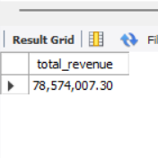
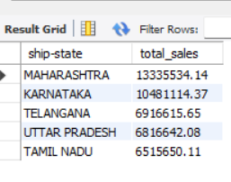

🛒 E-commerce Sales SQL Analysis

📊 Project Overview

This project analyzes e-commerce sales data using SQL to extract meaningful business insights. It focuses on understanding sales performance, customer behavior, and order trends.

🛠️ Tools Used

MySQL

SQL

📂 Dataset

The dataset contains e-commerce sales records, including order details, revenue, product categories, order status, and fulfillment information.

📈 Key Analysis

Total number of orders

Total revenue generated

Order distribution by status

Top 5 states by sales

Top 10 selling products

Sales by fulfillment type

🔍 Key Insights

A small number of states contribute significantly to overall sales

Certain products dominate total order volume

Order status distribution highlights delivery and cancellation patterns

Fulfillment methods influence order processing and distribution

🧾 SQL Queries

All SQL queries are included in the file:
ecommerce_sales_analysis.sql
Each query is well-structured and commented for better readability.

📁 Files Included

ecommerce_sales_analysis.sql

1_total_revenue.png

2_top_states.png

## 📸 Sample Output

🚀 Conclusion

This project demonstrates strong SQL skills in data extraction, aggregation, and business analysis. It showcases the ability to transform raw data into actionable insights for decision-making.

⭐ Future Improvements

Add advanced SQL queries (JOINs, subqueries, CASE statements)

Integrate with Power BI for visualization

Include dataset for better reproducibility
